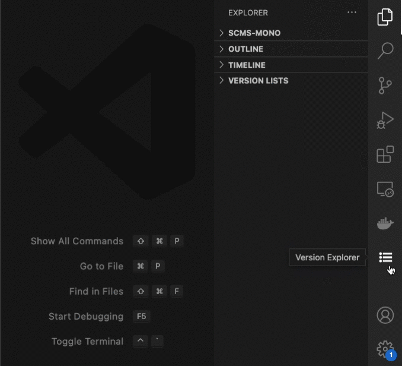

# Version Shuttle README

This extension lists and manages versions(branches) of your web programe, it named as version shuttle, as it thinks a branch as a version. if you are blighted by maintaining a multi-verison program -- such as a tob web repo, this extension might come in handy for you !

## Features

version-shuttle could list all branches of your current repo and allow you to chekcout each of them:

> Tip: Each of them can be checkout except for the local branch which is already exists.

Then shuttle between them and coding as uaual:

> Tip: the branches you checkout will stored in a folder named "_version-store" at the same directory with your repo.

**Enjoy!**
